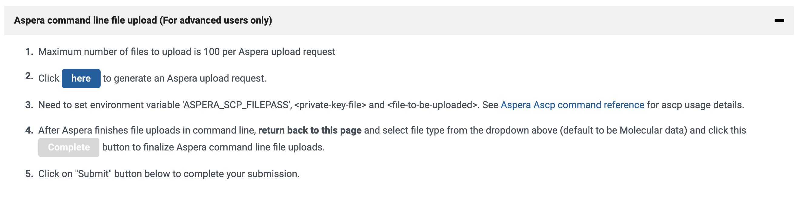

# Upload Preprocessing Service

This repo contains a docker container that will process VCF and BAM files to send to DBGap. The code relies on messages from SQS to know which files to process.

## Local Dev
1) Create a Virtual Environment with `python3 -m venv venv`
2) Install necessary libraries with `python3 -m pip install autopep8 boto3 requests pylint pysam`

## Uploading docker images to Amazon ECR

`aws ecr get-login-password --region us-east-1 | docker login --username AWS --password-stdin 646975045128.dkr.ecr.us-east-1.amazonaws.com`

`docker build -t ups .`

`docker tag ups:latest 646975045128.dkr.ecr.us-east-1.amazonaws.com/ups:latest`

`docker push 646975045128.dkr.ecr.us-east-1.amazonaws.com/ups:latest`

## Uploading VCF Files to dbGaP
You will need to ensure that the spreadsheets have been uploaded prior to submitting VCF files.

* Start by logging in to the [NIH Submission Portal](https://submit.ncbi.nlm.nih.gov/dbgap/17583/)
* Next create an Aspera upload request by clicking the button on step two as shown below
   
* Use the values provided to update the `ups-prod` entry in secrets manager
   * The `ASPERA_SCP_FILEPASS` value given on the NIH website should go into `aspera-pass` in secrets manager
   * The value from `subasp@upload.ncbi.nlm.nih.gov:uploads/upload_requests/<SOME_VALUE>/` should go into `aspera-location-code-vcf` in secrets manager
* Ensure you have 1 or more running ECS instances (see: [Creating ECS Instances](#creating-ecs-instances))
* Ensure you have 1 or more running ECS tasks (see: [Starting ECS Tasks](#starting-ecs-tasks))
* Schedule the VCFs files using the job on the `Export Tasks` page in Super Admin
* While the files are being processed you can monitor the queue (see: [Viewing the UPS SQS Queue](#viewing-the-ups-sqs-queue)) and view the logs (see: [Viewing the UPS Logs](#viewing-the-ups-logs)) to track progress
* Once all VCF files have been uploaded return to the NIH site to click the `Complete` button. __Note:__ When you created your request you were given a deadline. Be sure you can upload all VCFs and click the `Complete` button prior to that date or you will need to start over.

## Uploading BAM Files to dbGaP
You will need to ensure the spreadsheets have been QA'd and approved prior to submitting BAM files.

* Since you have already uploaded VCFs, the settings should be all set, just ensure your UPS tasks are running as they may have been spun down
* Schedule the BAM files using the job on the `Export Tasks` page in Super Admin
* While the files are being processed you can monitor the queue (see: [Viewing the UPS SQS Queue](#viewing-the-ups-sqs-queue)) and view the logs (see: [Viewing the UPS Logs](#viewing-the-ups-logs)) to track progress

## Creating ECS Instances
* TODO [Old Jira](https://hms-dbmi.atlassian.net/wiki/spaces/UDN/pages/74383364/UPS+Setup)

## Starting ECS Tasks
* TODO

## Viewing the UPS SQS Queue
* TODO

## Viewing the UPS Logs
* TODO

## Local Testing
If in testing mode, you can fire messages off to SQS to have the UPS docker process a real production file and save it in S3 for inspection.

You'll want to create a virtualenv that has boto3 installed. Then run the following:

`workon upload-preprocessing-service-docker`

`python`

`import boto3`

`sqs = boto3.resource(service_name='sqs', region_name='us-east-1', endpoint_url='[GET THE SQS URL]')`

`queue = sqs.get_queue_by_name(QueueName='upload-preprocessing')`

Now replace the key parts below and then paste in your terminal to send:

queue.send_message(MessageBody='queue_file', \
   MessageAttributes={ \
       'UDN_ID': {'StringValue': '[UDN ID]', \
                  'DataType': 'String'}, \
       'sample_ID': {'StringValue': '[guid of the sample]', \
                     'DataType': 'String'}, \
       'FileBucket': {'StringValue': 'udnarchive', \
                      'DataType': 'String'}, \
       'FileKey': {'StringValue':  '[exportfile.file_url]', \
                   'DataType': 'String'}, \
       'file_service_uuid': {'StringValue': '[exportfile.file_uuid]', \
                             'DataType': 'String'}, \
       'file_type': {'StringValue': '[VCF or BAM]', \
                     'DataType': 'String'}, \
       'md5': {'StringValue': ' ', \
               'DataType': 'String'} \
   })

Helpful queries to get the above:

`from dbgap.models import ExportFile`

`from patient.models import Sequence`

`from patient.models import SequenceCoreAlias`

`file = ExportFile.objects.get(filename='filename.vcf')`

`sequence = Sequence.objects.filter(patient__simpleid=file.exportlog.patient.simpleid)`

And get the values by:

UDN_ID = `file.exportlog.patient.simpleid`

sample_id = `sequence.first().sampleid`

FileKey = `'/'.join(file.file_url.split('/')[3:5])`

file_service_uuid = `file.file_uuid`

Give the EC2 instance some time to process the file and then look for it in the S3 under udn-files-test/ups-testing. You can monitor the ECS task's logs to see what it is doing.
